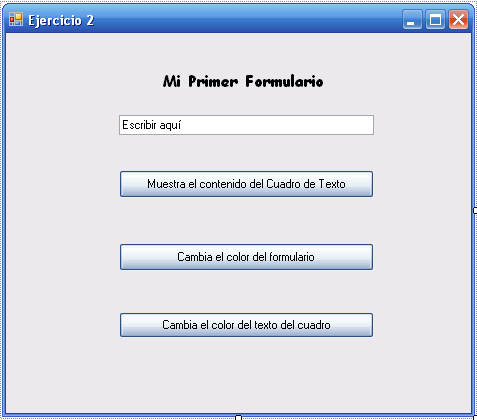
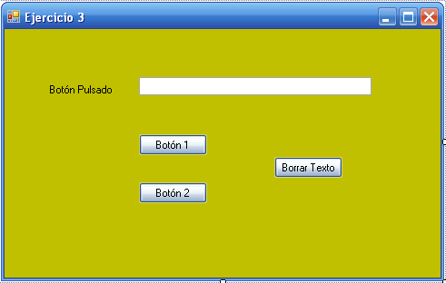

                                     

<br>

<a id="_apartado1"></a>

# Ejercicios Tema 1

### Ejercicio 1

En este ejercicio vamos a crear nuestra primera pequeña aplicación en Visual Studio y vamos a explorar algunas de las características del entorno de desarrollo.

1.	Abrir **Visual Studio**.

2.	Crear un **nuevo proyecto**.
   El proyecto será en Visual C# y la plantilla será la de aplicación para Windows. Poner nombre al proyecto (por ejemplo, **Ejercicio01**) e indicar la ubicación. Notar que se crea una carpeta con el nombre del proyecto.  
   Os recomiendo **crear una carpeta para cada uno de los temas**, y en ella ir guardando los proyectos de los distintos ejercicios de ese tema.

3.	Abrir el **explorador de soluciones**.

4.	Cambiar **propiedades del formulario**.
   En la ventana Propiedades cambiar su tamaño con la propiedad **size**.
   Después poner una imagen en el formulario con la propiedad **BackgroundImage**.

5.	**Añadir dos botones** al formulario.
   Abrir el Cuadro de Herramientas y colocar dos nuevos botones al formulario.
   Cambiar las propiedades Name y Text de los botones.

6.	Añadir código al **evento click** del primer botón.
   Hacer doble clic en el botón. Se abrirá el editor de código. 
   Añadir el siguiente código:  
   `MessageBox.Show("Se ha apretado el primer botón.");`

7.	**Ejecutar y probar** la aplicación con el botón Iniciar.

8.	Poner código similar para el segundo botón.

9.	Guardar el proyecto.

<br>

### Ejercicio 2

Realizar un nuevo proyecto (**Ejercicio02**) con un formulario con la siguiente apariencia:
 


Añadir el siguiente código para el evento Clic del primer botón:

```csharp
private void btnPrimero_Click(object sender, EventArgs e)
{
   MessageBox.Show(txtCuadroTexto.Text);
}
```

En el gestor de eventos del click del segundo botón añadir:

```csharp
BackColor = Color.CadetBlue;
```

Para el evento click del tercer botón poner:

```charp
txtCuadroTexto.ForeColor = Color.Red;
```

**Guardar** todo.

**Ejecutar** y probar la aplicación.
 

<br>

### Ejercicio 3

Realizar un nuevo proyecto (Ejercicio03) con un formulario similar al siguiente:

 

En esta aplicación al apretar el botón 1 o el 2 aparecerá en el cuadro de texto: **Se ha apretado el botón (1 o 2 según el caso)** y al apretar el botón de Borrar Texto se borrará el texto.

Guardar todo.
Ejecutar y probar la aplicación.


